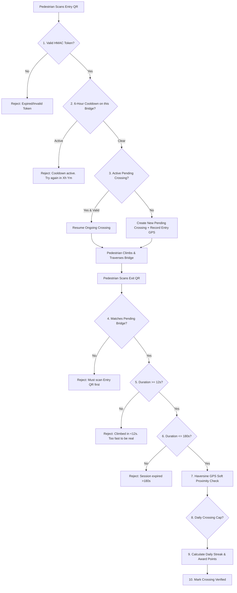
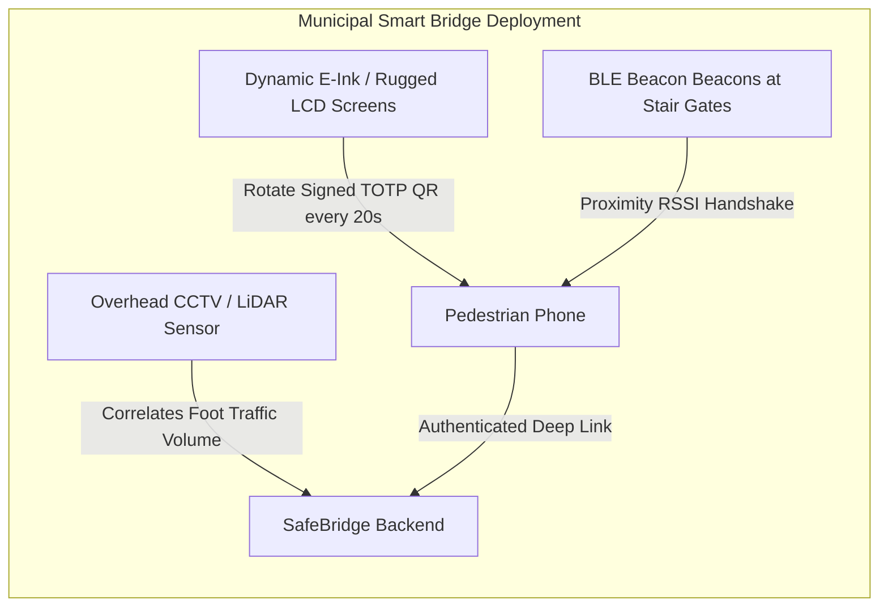

# 🌉 SafeBridge — Foot Over Bridge (FOB) Pedestrian Incentive & Anti-Fraud Platform

**SafeBridge** is a full MERN stack platform designed to eliminate hazardous street-level jaywalking along busy arterial corridors by rewarding pedestrians with redeemable points, transit vouchers, and merchant discounts for verifiably using Foot Over Bridges (FOBs).

---

## 🚀 Key Features

- **📱 Physical QR Deep-Link Entry**: Scannable QR stickers affixed at bridge staircases direct any native smartphone camera straight to the crossing verification flow (`/scan/:bridgeId/entry?token=...` & `/scan/:bridgeId/exit?token=...`) with no mobile app install required.
- **🔄 Zero-Friction Deep-Link Auth Preservation**: Unauthenticated users who scan a QR code have their intended crossing intent preserved in session storage; upon signing in or registering, they are automatically returned to their crossing step without needing to re-scan.
- **📷 In-App Camera Scanner**: Integrated `html5-qrcode` scanner supporting physical camera scanning, image upload, and direct URL entry for users who already have the web app open.
- **🛡️ Multi-Layer Server-Side Anti-Fraud Engine**: Comprehensive verification logic ensuring points are awarded strictly for genuine, safe climbs.
- **⏳ Dynamic 6-Hour Per-Bridge Cooldown**: Computed on the fly directly from the user's `Crossing` history on every check (never cached separately on the user model to prevent state drift).
- **🔥 Dynamic Daily Streaks & Leaderboard**: Automatic streak incrementing across consecutive calendar days and live city-wide safety leaderboards.
- **🎟️ Instant Voucher Redemption**: Cryptographically generated redemption codes (`crypto.randomBytes`) for transit cards, metro top-ups, and partner cafes.
- **⚡ Turnkey Zero-Config Execution**: Automatically runs with an embedded in-memory MongoDB server (`mongodb-memory-server`) if no external database URI is configured, and auto-seeds test bridges with real scannable QR data URIs.

---

## 🏗️ Architecture & Technology Stack

- **Backend**: Node.js, Express, MongoDB (Mongoose), JWT, BcryptJS, QRCode, Crypto HMAC
- **Frontend**: React 18 (Vite), React Router v6, Lucide Icons, Canvas Confetti, HTML5-QRCode
- **Styling**: Vanilla CSS Design System with a road-signage and transit aesthetic (Asphalt `#0d1117`, Signal Green `#10b981`, Hazard Amber `#f59e0b`, Signal Red `#ef4444`).

---

## 🛠️ Installation & Setup

### Prerequisites
- Node.js (v18+) & npm

### 1. Clone & Set Up Backend
```bash
cd backend

# Copy environment template
cp .env.example .env

# Install dependencies
npm install

# (Optional) Run automated anti-fraud unit flow tests
npm run test:flow

# Start backend server
npm start
```
*Backend runs on `http://localhost:5000` (Health check: `http://localhost:5000/api/health`)*.

### 2. Set Up Frontend
```bash
cd ../frontend

# Install dependencies
npm install

# Start Vite development server
npm run dev
```
*Frontend runs on `http://localhost:5173`*.

---

## 🔑 Demo Accounts & Seed Data

The database comes pre-seeded with 5 realistic urban FOB bridges (Mumbai Dadar, Bandra Skywalk, Bengaluru Silk Board, Delhi CP, Marine Drive), rewards catalog, and demo accounts:

| Role | Email | Password | Details |
| :--- | :--- | :--- | :--- |
| **Pedestrian** | `test@safebridge.app` | `Password123!` | Active commuter (175 pts, 3-day streak) |
| **Admin** | `admin@safebridge.app` | `Admin@123456` | Admin console access & anti-fraud logs |
| **Commuter (Top 1)** | `aravind@gmail.com` | `Password123!` | Leaderboard Champion (450 pts, 7-day streak) |

---

## 🛡️ Anti-Fraud Verification Engine (Deep-Dive)

Every anti-fraud check runs strictly **server-side**; client input is never trusted.



### Why Each Anti-Fraud Check Exists:

1. **Per-Bridge 6-Hour Cooldown (Derived on every check)**:
   - **Why**: Prevents a pedestrian from standing at one bridge and repeatedly scanning entry/exit in a loop to farm points.
   - **Dynamic derivation**: Derived directly by querying `Crossing.findOne({ user, bridge, status: 'verified', exitTimestamp: >= now - 6h })` rather than caching on the User document, guaranteeing it never drifts out of sync.
2. **Dual-Stairway Verification**:
   - **Why**: A crossing requires an entry scan at the foot stairs and an exit scan at the opposite landing stairs, guaranteeing the user physically navigated the FOB corridor.
3. **Minimum Climb Duration (`MIN_CROSSING_SECONDS = 12s`)**:
   - **Why**: Physically climbing 25-40 steps, walking the span (30-60m), and descending takes at minimum 15-30 seconds. An exit scan under 12 seconds indicates bot automation, pre-recorded codes, or a non-pedestrian vehicle drive-by.
4. **Maximum Session Timeout (`MAX_CROSSING_SECONDS = 180s`)**:
   - **Why**: Prevents stale sessions from being claimed hours or days later.
5. **Haversine GPS Telemetry (Soft Signal)**:
   - **Why**: Verifies browser latitude/longitude against stored FOB anchor coordinates. Because tall steel and concrete railway structures cause GPS multipath interference and signal degradation in urban canyons, this is treated as a soft signal (logged in flags) rather than hard-failing users.
6. **Short-Lived Signed HMAC Tokens**:
   - **Why**: URL tokens are signed with `crypto.createHmac('sha256', SECRET)` including timestamp windows, preventing infinite reuse of shared photographs or screenshots of QR stickers.
7. **Soft Daily Cap (`DAILY_CROSSING_CAP = 4`)**:
   - **Why**: Prevents extreme multi-bridge farming while still rewarding standard daily round-trip commutes.

---

## 🏭 Production & Physical Hardware Deployment Considerations

In this MVP/demo, QR codes and deep links simulate physical bridge stickers. For a real municipal smart city deployment, the following hardware upgrades would be implemented:



1. **Continuously Rotating Dynamic QR Displays**:
   - Instead of printed static stickers, solar-powered, vandal-resistant e-ink or high-brightness LCD displays at stair landings continuously generate time-synchronized TOTP/HMAC QR codes rotating every 15-30 seconds. Photographing the screen is useless after 30 seconds.
2. **Bluetooth Low Energy (BLE) Gateway Beacons**:
   - BLE beacons placed at the entry and exit stair portals emit direction-of-arrival (AoA) signals. The web app or background service detects RSSI signal strength to mathematically prove physical passage through the gate.
3. **Smart City Camera & LiDAR Telemetry Correlation**:
   - Overhead municipal traffic cameras (Vision Zero pedestrian safety feeds) running edge AI pedestrian count models correlate the aggregate count of people crossing the bridge with the volume of point claims issued during that time window.
4. **Hardware Security Modules (HSM)**:
   - Bridge controllers store signing keys in secure cryptographic hardware elements (ATECC608A / TPM) resistant to physical probing.
5. **HTTPS & Sensor Permission Mandate**:
   - Camera and Geolocation APIs require a secure origin (`HTTPS`) in live production environments (browsers exempt `localhost` during local development).

---

## 📂 Project Structure

```
safebridge/
├── backend/
│   ├── config/
│   │   └── db.js                 # MongoDB connection & MemoryServer fallback
│   ├── controllers/
│   │   ├── authController.js     # User registration, login, profile
│   │   ├── bridgeController.js   # Dynamic cooldown calculations & bridge catalog
│   │   ├── crossingController.js # Core Anti-Fraud verification engine
│   │   ├── rewardController.js   # Rewards catalog & crypto voucher generation
│   │   └── leaderboardController.js # Citywide pedestrian rankings & stats
│   ├── middleware/
│   │   ├── authMiddleware.js     # JWT protection & admin role check
│   │   └── errorHandler.js       # Centralized JSON error handling
│   ├── models/
│   │   ├── User.js               # Points ledger, streaks, password hashing
│   │   ├── Bridge.js             # Coordinates, points value, QR data URLs
│   │   ├── Crossing.js           # Anti-fraud timestamps, GPS, status, flags
│   │   ├── Reward.js             # Vouchers, partners, stock
│   │   └── Redemption.js         # Generated unique voucher codes
│   ├── utils/
│   │   ├── tokenUtils.js         # HMAC signing & token validation
│   │   ├── geoUtils.js           # Haversine distance formula & proximity checks
│   │   └── qrGenerator.js        # Real QR code PNG Data URL generation
│   ├── scripts/
│   │   ├── seedData.js           # Demo bridges, rewards, and test accounts
│   │   ├── seed.js               # CLI seed runner
│   │   └── testFlow.js           # Automated anti-fraud integration tests
│   ├── server.js                 # Express server entry point
│   └── package.json
│
├── frontend/
│   ├── src/
│   │   ├── components/
│   │   │   ├── Navbar.jsx        # Navigation, points pill, QR launcher
│   │   │   ├── Footer.jsx        # Safety mission & anti-fraud highlights
│   │   │   ├── BridgeCard.jsx    # Real-time ticking cooldown countdown badge
│   │   │   ├── QrViewerModal.jsx # Real scannable entry/exit QR codes + simulator
│   │   │   ├── InAppScannerModal.jsx # HTML5 camera QR scanner
│   │   │   └── ActiveCrossingBar.jsx # Sticky timer widget for active crossing
│   │   ├── context/
│   │   │   └── AuthContext.jsx   # Auth state & deep-link intent preservation
│   │   ├── pages/
│   │   │   ├── HomePage.jsx      # Hero, safety stats, 4-step workflow
│   │   │   ├── LoginPage.jsx     # Sign in with auto-resume crossing support
│   │   │   ├── RegisterPage.jsx  # Sign up with auto-resume crossing support
│   │   │   ├── DashboardPage.jsx # Stats, streaks, and crossing audit log
│   │   │   ├── BridgesPage.jsx   # Directory with search & cooldown filters
│   │   │   ├── ScanLandingPage.jsx # 4-stage QR/GPS/Server verification flow
│   │   │   ├── RewardsPage.jsx   # Vouchers catalog & crypto code generator
│   │   │   ├── LeaderboardPage.jsx # Top 3 podium & rankings
│   │   │   └── AdminPage.jsx     # Anti-fraud telemetry logs
│   │   ├── services/
│   │   │   └── api.js            # Fetch API client with JWT header injection
│   │   ├── index.css             # Road-signage design system
│   │   ├── App.jsx               # Routes & Layout
│   │   └── main.jsx
│   ├── index.html
│   ├── vite.config.js
│   └── package.json
└── README.md
```
